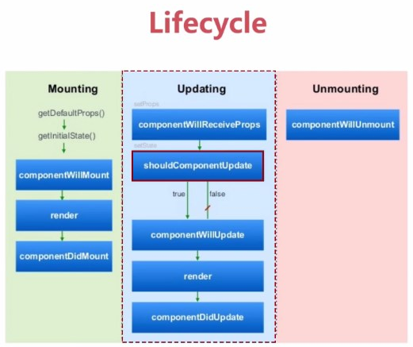

---
layout:     post
title:      react.js生命周期
category: blog
description: react.js笔记   
---   

;   

## Mounting初始化阶段（已插入真实 DOM）：
- getDefaultProps:只调用一次，实例之间共享引用
- getInitialState:获取每个实例的初始化状态
- componentWillMount：组件即将被装载、渲染到页面上（render之前最后一次修改状态的机会。如果在这个方法内调用setState,render()将会感知到更新后的state，将会执行仅一次，尽管state改变了）
- render:组件在这里生成虚拟的DOM节点（只能访问this.props和this.state，只有一个顶层组件，不允许修改状态和DOM输出）
- componentDidMount:成功render并渲染完成真实DOM之后触发，可以修改DOM

## Updating运行中阶段（正在被重新渲染）：
- componentWillReceiveProps:父组件修改属性触发，可以修改新属性、修改状态。它是在组件发生改变之前触发
- shouldComponentUpdate:组件接受到新属性或者新状态的时候（可以返回false，接收数据后不更新，阻止render调用，后面的函数不会被继续执行了）
- componentWillUpdate:不能修改属性和状态
- render:只能访问this.props和this.state；只有一个顶层组件，也就是说render返回值只能是一个组件；不允许修改状态和DOM输出
- componentDidUpdate:可以修改DOM

## Unmouting销毁阶段（已移出真实 DOM）：
- componentWillUnmount:在删除组件之前进行清理操作，比如计时器和事件监听器。或者清除在 componentDidMount 中创建的 DOM 元素。
