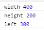

---
layout:     post
title:      打造自己的运动框架(7)  - 同时运动
category: blog
description: 一步一步打造属于自己的运动框架
---   
同时运动，比如向右移动的同时，变大，也同时改变颜色。就是我们将不同的属性在同一时间变换。   

### for in 循环

js遍历对象的时候可以使用for in循环   

```javascript
<!DOCTYPE html>
<html>
<head lang="en">
    <meta charset="UTF-8">
    <title></title>
</head>
<body>
<script>
    var arr = [1,"张三","李四",4,5];
    var obj = {
        "name":"张三",
        "性别":"男",
        "年龄":35
    }
   for(var i in arr){
        console.log(i,arr[i]);
    }
    for(var key in obj){
        console.log(key,obj[key]);
    }
</script>
</body>
</html>
```   

for in循环可以遍历数组或者对象，在js里面数组也是一个对象。
通过遍历下标值的方法遍历出整个对象。   

在我们的move函数里面，现在的需求是需要同时运动。那么我们可以将需要同时运动的参数传递到一个对象里面，假设这个对象的值是   

```javascript
var option = {
        "width":400,
        "height":200,
        "left":300
    }
```   

那么我们就可以将这个对象通过for in循环遍历出来。

```javascript
for(var key in option){
        console.log(key,option[key]);
    }
```   
结果是这样的   
   

将刚才的函数提出到一个js文件里面。   

### move.js   

```javascript
/**
 * Created by Administrator on 2016/12/25.
 */
/*
* 动画函数
* @obj 运动的对象
* @option {attr:终点值} 改变的属性列表
* @func 回调函数
*/
function move(obj,option,func){
    //每次进入函数都清除一次定时器
    clearInterval(obj.timer);
    obj.timer = setInterval(function () {
        //是否都已经到达的标记
        var flag = true;
        //循环改变的属性列表
        for(var attr in option){
            var speed;
            var start;
            //获取当前的样式
            if(attr == "opacity"){
                start = getStyle(obj,attr)*100;
            }else{
                start = parseInt(getStyle(obj,attr));
            }
            //计算速度
            speed = (option[attr] - start)/10;
            speed = speed>0?Math.ceil(speed):Math.floor(speed);
            //判断是否到达终点
            //如果说还有属性没有到达终点值，那么flag设为false
            if(option[attr] != start){
                flag = false;
            }
            //判断是否是透明度
            if(attr == "opacity"){
                start = start + speed;
                obj.style.opacity = start/100;
                obj.style.filter = "alpha(opacity:"+start+")";
            }else{
                //不是透明度的情况
                obj.style[attr] = start + speed + "px";
            }
        }
        //如果flag为true，那么全部都到达了终点值
        //如果全部都到达了终点，那么清除定时器
        if(flag){
            clearInterval(obj.timer);
            //判断是否有回调函数
            if(func){
                //执行回调函数
                func();
            }
        }
    },30)
}

/*
* 获取对象的样式函数
* @obj 对象
* @attr 获取的属性名
*/
function getStyle(obj,attr) {
    if(obj.currentStyle){
        return obj.currentStyle[attr];   //IE
    }else{
        return getComputedStyle(obj,false)[attr];  //谷歌
    }
}

```   

### 使用

```javascript
<!DOCTYPE html>
<html>
<head lang="en">
    <meta charset="UTF-8">
    <title></title>
    <script src="js/move.js"></script>
    <style>
        #div1{
            background-color: red;
            opacity: 0.3;
            width: 200px;
            height: 200px;
            filter:alpha(opacity:30);
            border-width: 4px;
            border-style:solid;
            border-color: #000000;
        }

        #div2{
            background-color: red;
            opacity: 0.3;
            width: 200px;
            height: 200px;
            filter:alpha(opacity:30);
            border: 4px solid #000000;
        }
    </style>
</head>
<body>
<div id="div1"></div>
<div id="div2"></div>
<script>
    var div1 = document.getElementById("div1");
    var div2 = document.getElementById("div2");
    div1.onmouseover = function () {
        move(this,{'opacity':100});
    }
    div1.onmouseout = function () {
        move(this,{'opacity':30});
    }
    div2.onmouseover = function () {
        move(div2,{'height':201,'width':400,'opacity':100}, function () {
            move(div2,{'height':400,'width':600,'opacity':10})
        });
    }
    div2.onmouseout = function () {
        move(div2,{'height':200,'width':200,'opacity':30}, function () {
        });
    }
</script>
</body>
</html>

```
1. for in循环将我们的动画的参数对象通过for in循环遍历出来，每个属性都执行一遍动画  
2. 这里有一个不能同时到达的bug，所以在定时器里面，定义一个flag，在for in循环里面如果还有参数没有 到达终点的，就将flag置为false。最后在for in循环结束后，再判断一下flag的值，如果flag都为true，说明传入的参数值都到达了终点，这个时候清除定时器。   

### 结束
基本完美的js动画框架完成了，恭喜。
是不是满满的成就感？
